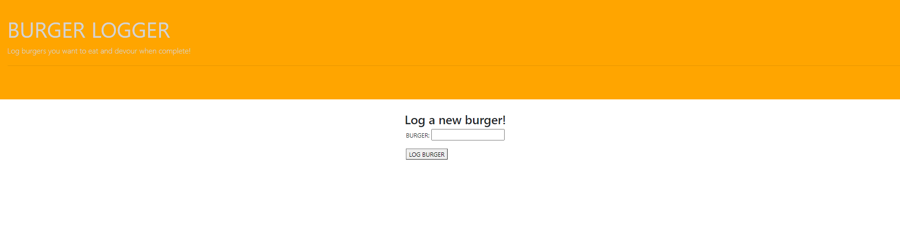
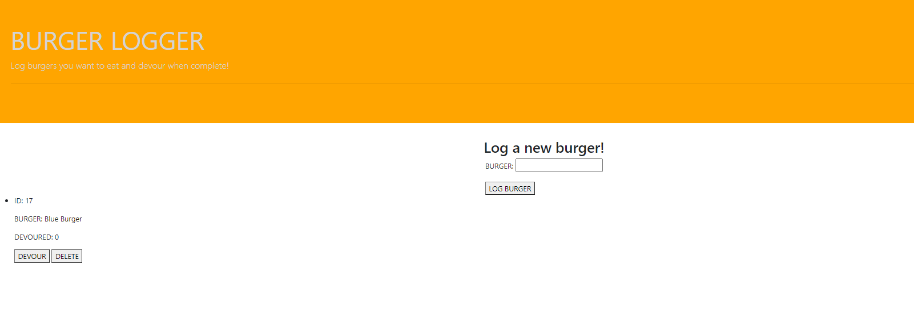
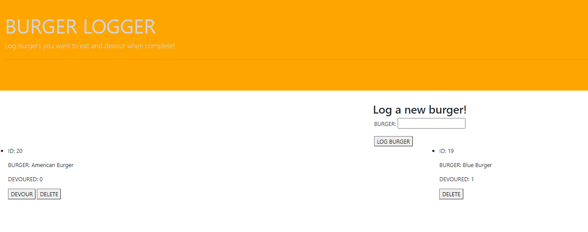

# Burger-Logger

 

## Description

This application was created a fun and interactive way to track which hamburgers you have eaten and which you would like to eat!

 

## Availability

This application can be found either through GitHub or Heroku through the following links.
GitHub: https://github.com/cr31293/Burger-Logger
Heroku: https://calm-river-83272.herokuapp.com/

 

## Functionality

 

### Running in the Localhost
Install the required dependencies by running `npm install` once you've navigated to the projects root directory. Launch the app by starting the server with `npm run watch` in the terminal and go to localhost:8000 in the browser

 

### Running in the Heroku deployed app
Visit the Heroku URL: https://calm-river-83272.herokuapp.com/ and the app will be ready for use

 

After setting up your local host or visiting the Heroku URL youre ready to list burgers to be eaten on your burger logger. App use is as simple as enter the name of the burger you'd like to log in and pressing the "Log Burger" button. A burger can be added to the devoured list by clicking the "Devour" button after its been logged. From there the user can chose to delete a burger entirely if they'd like.

# Images

This is the default burger-logger home screen

 

burger-logger with a burger added

burger-logger with a burger ready to be devoured

## Contributions
Authored by Chris Reed.

 
 

## Licensing
MIT License

Copyright (c) 2020 Chris Reed

Permission is hereby granted, free of charge, to any person obtaining a copy
of this software and associated documentation files (the "Software"), to deal
in the Software without restriction, including without limitation the rights
to use, copy, modify, merge, publish, distribute, sublicense, and/or sell
copies of the Software, and to permit persons to whom the Software is
furnished to do so, subject to the following conditions:

The above copyright notice and this permission notice shall be included in all
copies or substantial portions of the Software.

THE SOFTWARE IS PROVIDED "AS IS", WITHOUT WARRANTY OF ANY KIND, EXPRESS OR
IMPLIED, INCLUDING BUT NOT LIMITED TO THE WARRANTIES OF MERCHANTABILITY,
FITNESS FOR A PARTICULAR PURPOSE AND NONINFRINGEMENT. IN NO EVENT SHALL THE
AUTHORS OR COPYRIGHT HOLDERS BE LIABLE FOR ANY CLAIM, DAMAGES OR OTHER
LIABILITY, WHETHER IN AN ACTION OF CONTRACT, TORT OR OTHERWISE, ARISING FROM,
OUT OF OR IN CONNECTION WITH THE SOFTWARE OR THE USE OR OTHER DEALINGS IN THE
SOFTWARE.
